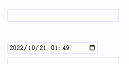

# html-InputAdviser

An adviser for HTML input tag 

## Preview



## Get

### 1. Directly use dist/InputAdviser.js

Just load InputAdviser.js by script tag and the `InputAdviser` is the class object.

### 2. Install from npm

```shell
npm i inputadviser
```
Then in your javascript code

```javascript
import InputAdviser from 'inputadviser'
```

## Usage

```javascript
new InputAdviser('selector of the input or the element',async word=>{
	let list=[];
	//do something to get advice list
	list=[//just values
		'abc',
		'bdc',
		'poi',
	];

	list=[//values with descriptions
		{
			value:'abc',
			desc:'this is abc',
		},
		{
			value:'bdc',
			desc:'this is bdc',
		},
		{
			value:'poi',
			desc:'this is poi',
		},
	];
	return list;
});

```